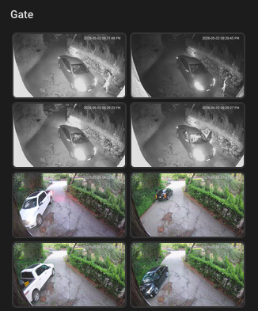
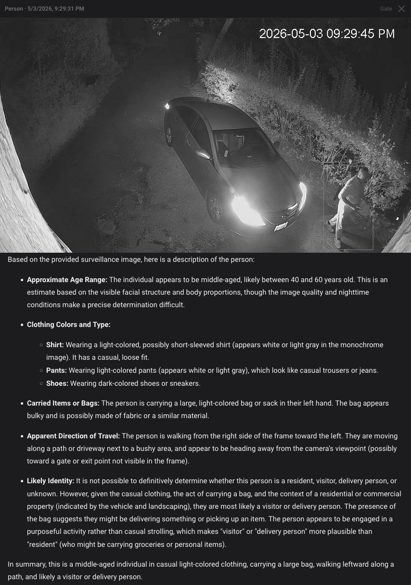

# Frigate AI Event Card

[](https://github.com/castellotti/frigate-ai-event-card)
[](LICENSE)
[](https://github.com/castellotti/frigate-ai-event-card/releases)

A Lovelace card that displays a filmstrip of recent Frigate detection events with AI-generated descriptions and inline clip playback.

 

## Features

- **Filmstrip** - auto-sized or scrollable row of event thumbnails
- **AI descriptions** - click any thumbnail to open a snapshot + `<ha-markdown>` description dialog
- **HLS clip playback** - click the snapshot to stream the recording via HA's Frigate VOD proxy; no Frigate JWT required in the browser
- **Time-window filter** - show only events from the last 24 h, 7 d, 30 d, or a custom window
- **Multi-Frigate** - one card per sensor, stack them with `vertical-stack`
- **Vision-provider agnostic** - works with Ollama, OpenAI, Anthropic, Gemini, llama.cpp, or any provider Frigate supports
- **No build step** - single vanilla JS file, drop-in install

## Requirements

- **Frigate 0.17+** with `genai:` configured
- **HA Frigate integration** installed
- **An HA sensor** exposing the [documented event shape](#sensor-setup)

## Installation

### HACS (recommended)

1. In HACS → Integrations, click the three-dot menu → **Custom repositories**
2. Add `https://github.com/castellotti/frigate-ai-event-card` as type **Dashboard**
3. Install **Frigate AI Event Card**
4. Reload the browser

### Manual

1. Download `frigate-ai-event-card.js` from the [latest release](https://github.com/castellotti/frigate-ai-event-card/releases)
2. Copy it to `/config/www/frigate-ai-event-card.js` on your HA host
3. Add a Lovelace resource:

```yaml
# configuration.yaml
frontend:
  extra_module_url:
    - /local/frigate-ai-event-card.js
```

Or add via **Settings → Dashboards → Resources → Add resource** with URL `/local/frigate-ai-event-card.js`, type **JavaScript module**.

## Quick Start

```yaml
type: custom:frigate-ai-event-card
entity: sensor.frigate_camera_front_events
title: Front Door
frigate_slug: frigate
```

## Configuration Reference

| Option | Type | Default | Description |
|---|---|---|---|
| `entity` | string | **required** | HA sensor entity ID. Alias: `sensor` |
| `title` | string | - | Card header text. Omit for no header |
| `limit` | `auto` \| integer | `auto` | Number of thumbnails to show. `auto` fills available width |
| `scrollable` | boolean | `false` | Enable horizontal scroll; shows all events |
| `thumbnail_height` | integer | `80` | Thumbnail height in pixels |
| `time_window` | string | `all` | Filter: `24h`, `7d`, `30d`, `all`, or `<N>m`/`<N>h`/`<N>d` |
| `filter_no_description` | boolean | `true` | Hide events without an AI description |
| `show_metadata` | boolean | `true` | Show zones/plate/sub_label in dialogs |
| `frigate_slug` | string | - | HA Frigate integration client ID. Enables clip playback |
| `clip_button_text` | string | `▶ Watch clip` | Label for the clip button |
| `provider_label` | string | - | Small badge below filmstrip, e.g. `Powered by Qwen3-VL` |

See [`docs/card-config.md`](docs/card-config.md) for full option details.

## Sensor Setup

The card reads `state.attributes.events` from a configured HA sensor. Each event must include:

| Field | Type | Required |
|---|---|---|
| `id` | string | yes |
| `start_time` | number (unix seconds) | yes |
| `thumbnail_url` | string | yes |
| `description` | string | recommended |
| `label` | string | recommended |
| `camera` | string | for clip playback |
| `end_time` | number | for clip playback |
| `sub_label` | string | optional |
| `zones` | string[] | optional |
| `plate` | string | optional |

> **Important:** `thumbnail_url` must be loadable from an `` tag in HA context (same-origin). The recommended approach is to cache snapshots to `/config/www/` - see [`docs/sensor-setup.md`](docs/sensor-setup.md).

### Sensor example

```yaml
# examples/sensor-command-line.yaml - see full file for comments
command_line:
  - sensor:
      name: "Frigate Camera Front Events"
      unique_id: frigate_camera_front_events
      scan_interval: 30
      command: "/bin/sh /config/scripts/fetch_frigate_events.sh"
      value_template: "{{ value_json.count }}"
      json_attributes:
        - count
        - events
```

See [`examples/sensor-command-line.yaml`](examples/sensor-command-line.yaml) and [`docs/sensor-setup.md`](docs/sensor-setup.md) for step-by-step setup including the wrapper script and `frigate_events.py` preprocessor.

## Frigate GenAI Setup

Any `genai:` provider supported by Frigate works. See [`examples/frigate-genai-config.yaml`](examples/frigate-genai-config.yaml) for ready-to-use snippets for Ollama, OpenAI, Anthropic, Gemini, and llama.cpp.

## Multi-Frigate

One card per sensor; group cameras with `vertical-stack`:

```yaml
type: vertical-stack
cards:
  - type: custom:frigate-ai-event-card
    entity: sensor.frigate_camera_driveway_events
    title: Driveway
    frigate_slug: frigate
  - type: custom:frigate-ai-event-card
    entity: sensor.frigate_gpu_camera_gate_events
    title: Gate
    frigate_slug: frigate-gpu
```

See [`docs/multi-instance.md`](docs/multi-instance.md) for a worked multi-Frigate example.

## Troubleshooting

**Sensor shows unavailable**
Check that your REST sensor is polling correctly. In HA Developer Tools → States, find your sensor entity and inspect the `events` attribute. Verify the Frigate API is reachable from HA.

**Thumbnails show as broken images (401)**
`thumbnail_url` is cross-origin to HA. The Frigate JWT cookie is `SameSite=Lax` and won't be sent on cross-origin image requests. Solutions:
1. Cache snapshots to `/config/www/frigate_thumbnails/` (recommended) - see [`docs/sensor-setup.md`](docs/sensor-setup.md)
2. Use the HA Frigate proxy `/api/frigate/{config_entry_id}/notifications/{event_id}/snapshot.jpg`
3. Log into Frigate in the same browser session (fragile, not recommended)

**JWT expiry / 401 errors after HA restart**
Frigate JWTs are long-lived. If you see `bad_signature` in Frigate logs after an image update, wait a few minutes for Frigate to regenerate its signing key.

**hls.js blocked by CSP**
If your HA instance has a strict Content-Security-Policy that blocks `cdn.jsdelivr.net`, you'll need to self-host hls.js at `/config/www/hls.min.js` and modify the `_loadHls` loader URL, or configure your CSP to permit the CDN.

**`frigate_slug` mismatch**
The slug must match the client ID used by the HA Frigate integration. Check **Settings → Integrations → Frigate** and note the integration's URL; the slug is the value you set in `frigate_slug` on the card. The HA Frigate VOD proxy routes by slug - a mismatch causes 404.

## Contributing

- Open an issue for bugs or feature requests
- PRs welcome - keep to vanilla JS, no build step, single file

## License

MIT © 2026 Steven Castellotti
